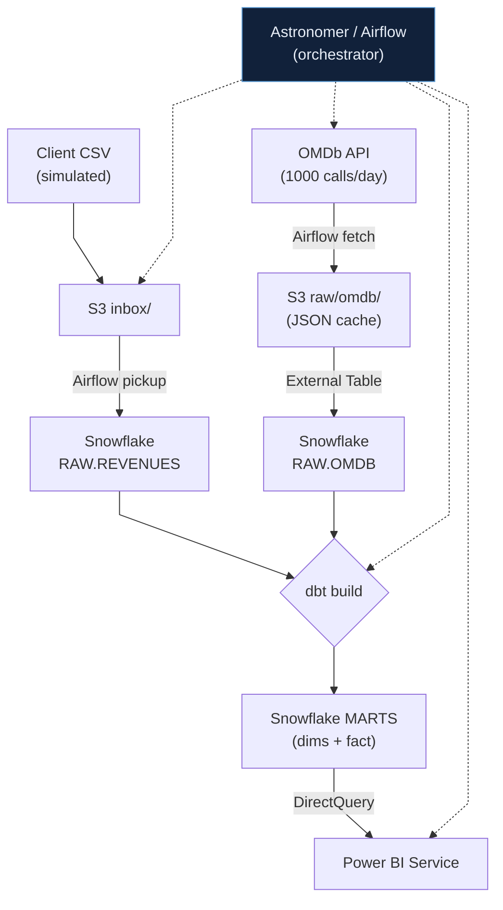
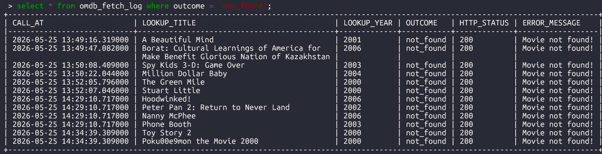
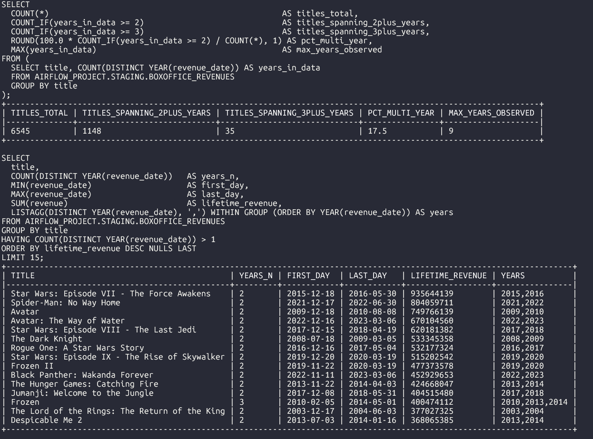
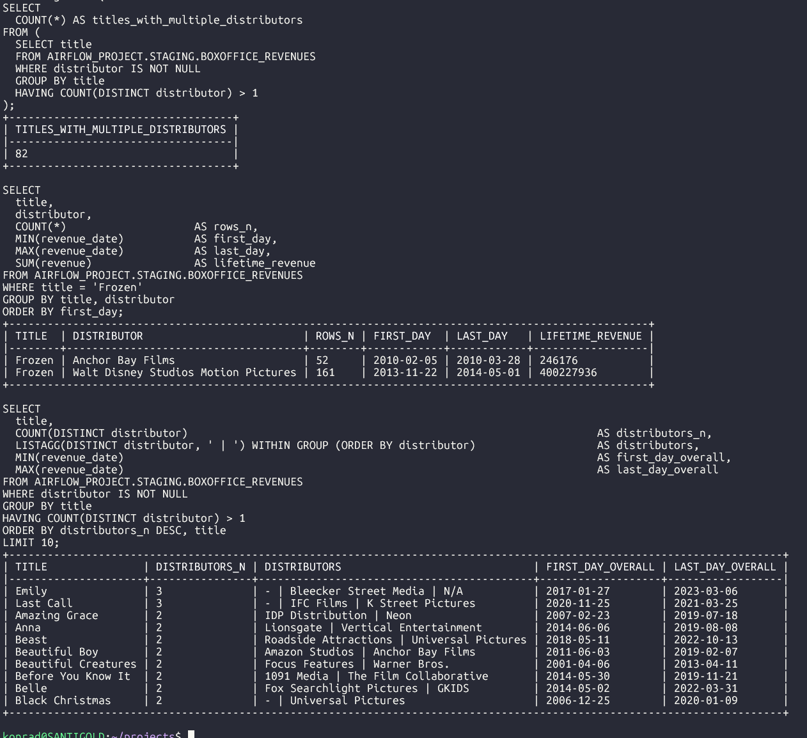
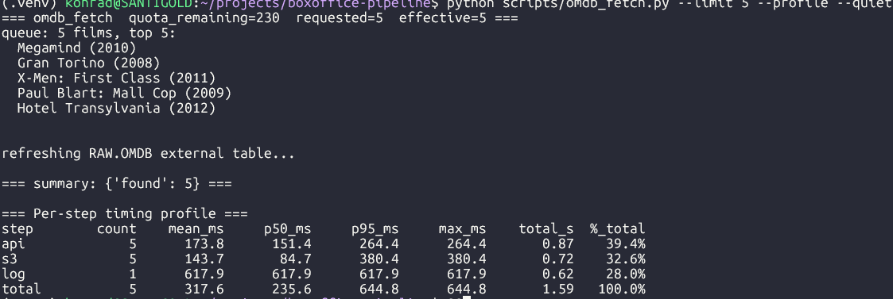
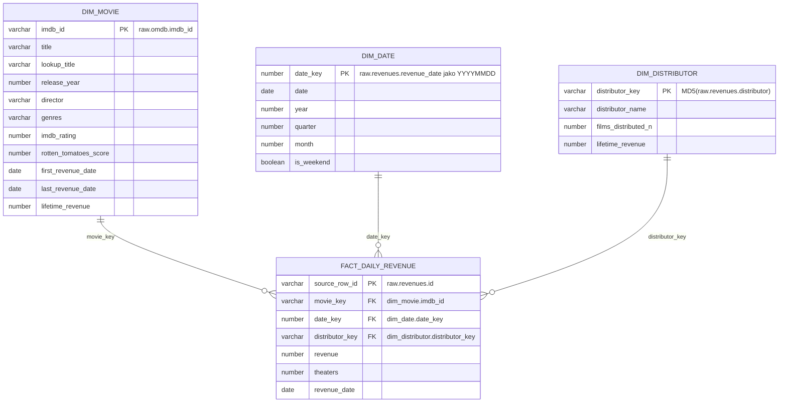

# boxoffice-pipeline

Demo data pipeline. Symuluje proces otrzymywania plików źródłowych (w tym przypadku CSV) z dziennymi przychodami z box-office. Pliki wrzucane są na S3, uzupełniane o metadane z OMDb API, by finalnie wylądować w Snowflake gdzie za pomocą dbt je testujemy i budujemy model danych. Model ten konsumowany jest przez raport w Power BI Service. Wszystko orkiestrowane przez Airflow na Astronomer.

## Stack i kluczowe decyzje

Skoncentrowałem się na części EL i muszę przyznać, że zadanie okazało się naprawdę ciekawe — nie tyle pod kątem samego wykonania, co optymalizacji.

- **Snowflake** — oprócz raczej typowej struktury myślę, że punktem wartym omówienia jest użycie External Table oraz procedur do ładowania danych.
- **dbt** — warto zwrócić uwagę, że to w tej warstwie sprawdzam duplikaty.
- **Airflow** (Astronomer) — jeden DAG, 4 taski w łańcuchu: `raw_data_ingestion` → `omdb_api_enrichment` → `dbt_build` → `refresh_pbi`.
- **Power BI** — uczciwie przyznaję, że wyszedłem z założenia, że wizualna część raportu nie jest tutaj punktem najważniejszym, dlatego czas głównie poświęciłem na część EL całego procesu.

## How it works



## Co sprawdziłem przed rozpoczęciem i co miało wpływ na finalną strukturę

**Data quality**



<details><summary>Multi-year films — pokaż screen</summary>



</details>

<details><summary>Title collisions — pokaż screen</summary>



</details>

**Performance**



## Założenia jakie przyjąłem

- **Darmowy plan OMDb to 1000 wywołań/dzień.** Skrypt pobierający trzyma licznik w `OMDB_FETCH_LOG` z buforem 50 wywołań na ponowne próby i ręczne testy.
- **Finalny odbiorca chce widzieć w raporcie tylko rekordy uzupełnione o dane z OMDb API.**
- **Klient przysyła dane za kwartał** — dlatego tak właśnie podzieliłem plik źródłowy (`data_YYYYq{1-4}.csv.gz`).

## Jak to wygląda w praktyce

Pełen przebieg pipeline'u w wideo:

| End-to-end demo | Logs & observability |
|:---:|:---:|
| [](https://youtu.be/wKI8-XWdvwA) | [](https://youtu.be/V4gAZ_OnRz8) |

## Struktura S3

```
s3://kk-demo-pipeline/
├── inbox/                                  # symulowane wrzucenie pliku przez klienta
│   └── box_office/
│       └── year=YYYY/
│           └── data_YYYYq{1-4}.csv.gz      # podział kwartalny (założenie: klient przysyła raz na kwartał)
│
├── raw/                                    # tu wskazują stage'e Snowflake
│   ├── box_office/                         # CSV w trakcie COPY INTO (pusty między uruchomieniami)
│   │   └── <file>.csv.gz
│   └── omdb/                               # cache JSONów z OMDb, partycjonowanie wg daty pobrania
│       └── yyyy=YYYY/mm=MM/dd=DD/
│           └── <imdbID>.json
│
└── archive/                                # audyt po załadowaniu
    └── box_office/
        └── YYYY-MM-DD/                     # data uruchomienia ingestion
            └── <file>.csv.gz
```

| Prefix | Właściciel | Czytane przez | Cykl życia |
|---|---|---|---|
| `inbox/` | "klient" (symulacja) | Airflow `raw_data_ingestion` | plik usuwany po przeniesieniu do `raw/` |
| `raw/box_office/` | Airflow | Snowflake stage `S3_BOX_OFFICE` | plik usuwany po przeniesieniu do `archive/` |
| `raw/omdb/` | Airflow `omdb_api_enrichment` | Snowflake stage `S3_OMDB` (External Table) | append-only, nigdy nie kasowane |
| `archive/box_office/` | Airflow | nikt (audyt / odtworzenie) | append-only |

## ER model



## Playground

[**pipeline.konradkolenda.dev**](https://pipeline.konradkolenda.dev/)

Zdaję sobie sprawę, że szeroko rozumiany frontend (czy też web development) nie jest czymś koniecznym w pracy data engineera, ale próba jego stworzenia okazała się dla mnie na tyle interesującym (i rozwijającym) zadaniem, że postanowiłem poświęcić na to czas.
